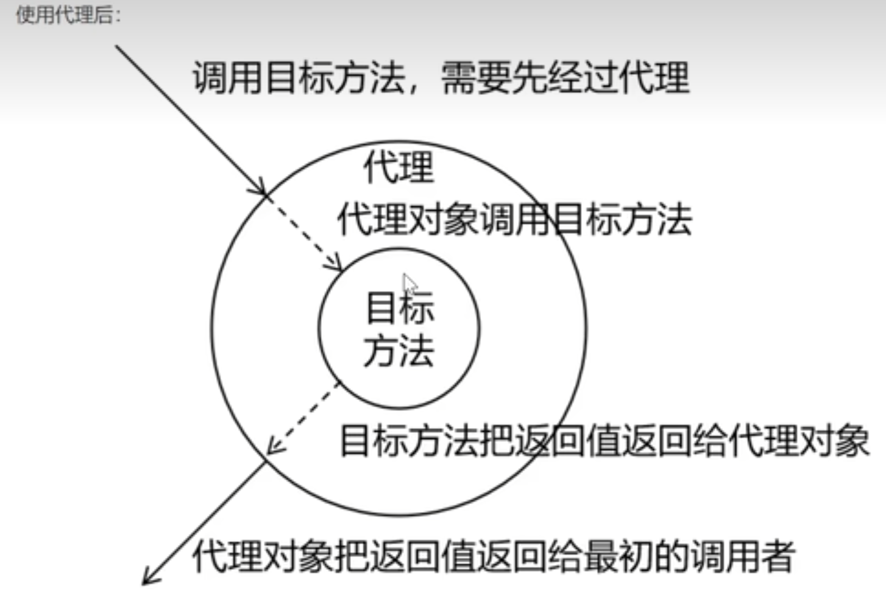

# 代理模式
二十三种设计模式中的一种,属于结构型模式。它的作用就是通过提供一一个代理类,让我们在调用目标方法的时
候,不再是直接对目标方法进行调用,而是通过代理类间接调用用。让不属于目标方法核心逻辑的代码从目标方法中
剥离出来一一解耦。调用目标方法时先调用代理对象的方法去,减少对目标方法的调用和打扰,同时让附加功能能够
集中在一起也有利于统一维护。

**代理模式在Java中实现方式有很多种，这里以JDK动态代理为例进行介绍。JDK动态代理主要依赖java.lang.reflect包下的Proxy类和InvocationHandler接口。**

# 静态代理
再写一个类，然后把目标类放进去，使用对象传递来封装，实现解耦
但是这个有很大的问题，就是他会很死板不够灵活，如果目标类有修改，那么代理类也要跟着修改

# 动态代理
动态代理就是代理类和目标类都不需要修改，通过代理类来代理目标类，代理类和目标类是解耦的，
import java.lang.reflect.InvocationHandler;
import java.lang.reflect.Method;
import java.lang.reflect.Proxy;
```java
public class ProxyFactory {
    private Object target;//目标对象

    public ProxyFactory(Object target) {
        this.target = target;
    }
    //* Proxy.newProxyInstance()方法
    //有三个参数
    //第一个参数:ClassLoader:加载动态生成代理类的来加载器
    //第二个参数:Class[]interfaces:目录对象实现的所有接口的class类型数组
    //第三个参数:InvocationHandler
    public Object getProxy(Object target) {

        ClassLoader  classLoader = target.getClass().getClassLoader();
        Class<?>[] interfaces = target.getClass().getInterfaces();
        InvocationHandler invocationHandler =new InvocationHandler() {
//            第一个参数
//            第二个参数 Method method:正在执行的方法
//            第三个参数 Object[] args:执行方法参数
            @Override
            public Object invoke(Object proxy, Method method, Object[] args) throws Throwable {
                System.out.println("[动态代理][日志]..."+method.getName()+"参数："+ Arrays.toString(args) );
                //执行目标对象方法
                Object returnValue = method.invoke(target, args);
                System.out.println("[动态代理][日志]..."+method.getName()+"结果："+ returnValue );
                return returnValue;
            }
        };

        return Proxy.newProxyInstance(classLoader ,interfaces, invocationHandler);
    }
}

```