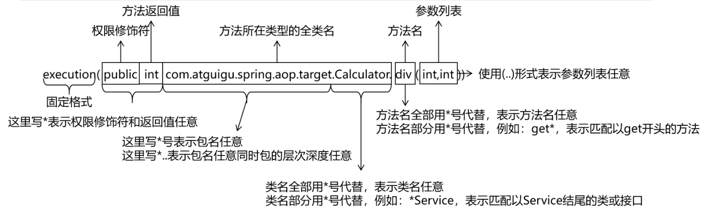

# 代理模式

二十三种设计模式中的一种,属于结构型模式。它的作用就是通过提供一一个代理类,让我们在调用目标方法的时
候,不再是直接对目标方法进行调用,而是通过代理类间接调用用。让不属于目标方法核心逻辑的代码从目标方法中
剥离出来一一解耦。调用目标方法时先调用代理对象的方法去,减少对目标方法的调用和打扰,同时让附加功能能够
集中在一起也有利于统一维护。

**代理模式在Java中实现方式有很多种，这里以JDK动态代理为例进行介绍。JDK动态代理主要依赖java.lang.reflect包下的Proxy类和InvocationHandler接口。
**

# 静态代理

再写一个类，然后把目标类放进去，使用对象传递来封装，实现解耦
但是这个有很大的问题，就是他会很死板不够灵活，如果目标类有修改，那么代理类也要跟着修改

# 动态代理

动态代理就是代理类和目标类都不需要修改，通过代理类来代理目标类，代理类和目标类是解耦的，
import java.lang.reflect.InvocationHandler;
import java.lang.reflect.Method;
import java.lang.reflect.Proxy;

```java
public class ProxyFactory {
    private Object target;//目标对象

    public ProxyFactory(Object target) {
        this.target = target;
    }

    // Proxy.newProxyInstance()方法
    //有三个参数
    //第一个参数:ClassLoader:加载动态生成代理类的类加载器
    //第二个参数:Class[]interfaces:目录对象实现的所有接口的class类型数组
    //第三个参数:InvocationHandler
    public Object getProxy() {

        ClassLoader classLoader = target.getClass().getClassLoader();
        Class<?>[] interfaces = target.getClass().getInterfaces();
        InvocationHandler invocationHandler = new InvocationHandler() {
            // 第一个参数
            // 第二个参数 Method method:正在执行的方法
            // 第三个参数 Object[] args:执行方法参数
            @Override
            public Object invoke(Object proxy, Method method, Object[] args) throws Throwable {
                System.out.println("[动态代理][日志]..." + method.getName() + "参数：" + Arrays.toString(args));
                //执行目标对象方法
                Object returnValue = method.invoke(target, args);
                System.out.println("[动态代理][日志]..." + method.getName() + "结果：" + returnValue);
                return returnValue;
            }
        };

        return Proxy.newProxyInstance(classLoader, interfaces, invocationHandler);
    }
}

```

- 前置通知：使用@Before 注解标识，在被代理的目标方法 **前** 执行
- 返回通知：使用@AfterReturning 注解标识，在被代理的目标方法 **成功结束** 后执行（**寿终正寝**）
- 异常通知：使用@AfterThrowing 注解标识，在被代理的目标方法 **异常结束** 后执行（**死于非命**）
- 后置通知：使用@After 注解标识，在被代理的目标方法 **最终结束** 后执行（**盖棺定论**）
- 环绕通知：使用@Around 注解标识，使用 try...catch...finally 结构围绕 **整个** 被代理的目标方法，包括上面四种通知对应的所有位置
#### 各种通知

- 前置通知：使用@Before 注解标识，在被代理的目标方法 **前** 执行
- 返回通知：使用@AfterReturning 注解标识，在被代理的目标方法 **成功结束** 后执行（**寿终正寝**）
- 异常通知：使用@AfterThrowing 注解标识，在被代理的目标方法 **异常结束** 后执行（**死于非命**）
- 后置通知：使用@After 注解标识，在被代理的目标方法 **最终结束** 后执行（**盖棺定论**）
- 环绕通知：使用@Around 注解标识，使用 try...catch...finally 结构围绕 **整个** 被代理的目标方法，包括上面四种通知对应的所有位置

 语法细节**

- 用*号代替“权限修饰符”和“返回值”部分表示“权限修饰符”和“返回值”不限
- 在包名的部分，一个“*”号只能代表包的层次结构中的一层，表示这一层是任意的。
  - 例如：*.Hello 匹配 com.Hello，不匹配 com.atguigu.Hello
- 在包名的部分，使用“*..”表示包名任意、包的层次深度任意
- 在类名的部分，类名部分整体用*号代替，表示类名任意
- 在类名的部分，可以使用*号代替类名的一部分
  - 例如：*Service 匹配所有名称以 Service 结尾的类或接口

- 在方法名部分，可以使用*号表示方法名任意
- 在方法名部分，可以使用*号代替方法名的一部分
  - 例如：*Operation 匹配所有方法名以 Operation 结尾的方法

- 在方法参数列表部分，使用(..)表示参数列表任意
- 在方法参数列表部分，使用(int,..)表示参数列表以一个 int 类型的参数开头
- 在方法参数列表部分，基本数据类型和对应的包装类型是不一样的
  - 切入点表达式中使用 int 和实际方法中 Integer 是不匹配的
- 在方法返回值部分，如果想要明确指定一个返回值类型，那么必须同时写明权限修饰符
  - 例如：execution(public int *..* Service.*(.., int))	正确
    例如：execution(* int *..*Service.*(.., int))	错误

# 重用切入点表达式
在同一个切面中使用
```java
@Before("pointCut()")
public void beforeMethod(JoinPoint joinPoint){
    String methodName = joinPoint.getSignature().getName();
    String args = Arrays.toString(joinPoint.getArgs());
    System.out.println("Logger-->前置通知，方法名："+methodName+"，参数："+args);
}
```
        
在不同切面中使用
```java

@Before("com.atguigu.aop.CommonPointCut.pointCut()")
public void beforeMethod(JoinPoint joinPoint){
    String methodName = joinPoint.getSignature().getName();
    String args = Arrays.toString(joinPoint.getArgs());
    System.out.println("Logger-->前置通知，方法名："+methodName+"，参数："+args);
}
@After("com.atguigu.aop.CommonPointCut.pointCut()")
```
# 切面的优先级
相同目标方法上同时存在多个切面时，切面的优先级控制切面的 **内外嵌套** 顺序。

- 优先级高的切面：外面
- 优先级低的切面：里面

使用@Order 注解可以控制切面的优先级：

- @Order(较小的数)：优先级高
- @Order(较大的数)：优先级低
